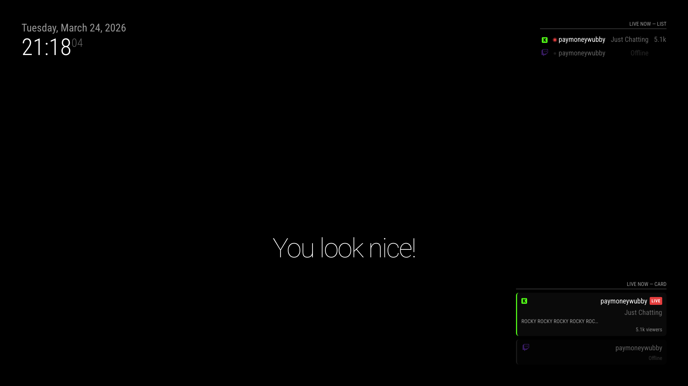

# MMM-StreamerStatus

A [MagicMirror²](https://github.com/MichMich/MagicMirror) module that shows which streamers from your list are currently live, supporting **Twitch**, **Kick**, and **YouTube**.

Displays streamer name, platform, current game/category, and live viewer count. Supports two display styles: a compact list or a card grid.



---

## What Credentials Do I Need?

| Platform | Required config fields | Where to get them |
|---|---|---|
| Twitch | `twitchClientId` + `twitchClientSecret` | [dev.twitch.tv/console](https://dev.twitch.tv/console) |
| Kick | `kickClientId` + `kickClientSecret` | [dev.kick.com](https://dev.kick.com) |
| YouTube | `youtubeApiKey` + `channelId` per streamer | [console.cloud.google.com](https://console.cloud.google.com) |

Only configure the platforms you actually use. Missing credentials cause that platform to be skipped gracefully — no errors.

---

## Dependencies

- An installation of [MagicMirror²](https://github.com/MichMich/MagicMirror)
- Node.js **v18 or higher** (required for the built-in `fetch` API)
- A **Twitch application** (Client ID + Secret) — if you have Twitch streamers
- A **YouTube Data API v3 key** — if you have YouTube streamers
- No credentials needed for Kick

---

## Installation

**1. Navigate to your MagicMirror `modules` folder:**

```bash
cd ~/MagicMirror/modules
```

**2. Clone this repository:**

```bash
git clone https://github.com/brandaorafael/MMM-StreamerStatus
```

No `npm install` is needed — this module has no external dependencies.

---

## Getting API Credentials

### Twitch

You need a free Twitch Developer application to access the Twitch API.

1. Go to [dev.twitch.tv/console](https://dev.twitch.tv/console) and log in with your Twitch account.
2. Click **"Register Your Application"**.
3. Fill in the form:
   - **Name:** anything (e.g. `MagicMirror`)
   - **OAuth Redirect URLs:** `http://localhost`
   - **Category:** `Other`
4. Click **Create**, then open the application.
5. Copy your **Client ID**.
6. Click **"New Secret"** to generate a **Client Secret** — copy it immediately, it won't be shown again.

Use these values for `twitchClientId` and `twitchClientSecret` in your config.

### YouTube

You need a Google Cloud project with the YouTube Data API enabled.

> **Quota note:** The free tier gives you **10,000 units per day**. Each YouTube channel status check costs ~101 units. With the default 15-minute poll interval, you can safely monitor **1 channel** within the free quota. For each additional YouTube channel, increase `youtubeUpdateInterval` proportionally (e.g. 2 channels → 30 minutes).

1. Go to the [Google Cloud Console](https://console.cloud.google.com) and create a new project (or use an existing one).
2. In the left menu, go to **APIs & Services → Library**.
3. Search for **"YouTube Data API v3"** and click **Enable**.
4. Go to **APIs & Services → Credentials**.
5. Click **"Create Credentials" → "API Key"**.
6. Copy the generated API key.

Use this value for `youtubeApiKey` in your config.

> **Finding a YouTube Channel ID:** The channel ID is the `UC...` string in the channel's URL (e.g. `youtube.com/channel/UCX6OQ3DkcsbYNE6H8uQQuVA`). If the channel uses a handle like `@mrbeast`, go to their page, click "About", and look for the channel ID there — or right-click the page → "View page source" and search for `"channelId"`.

### Kick

Kick requires a free developer application to access their official public API.

1. Go to [dev.kick.com](https://dev.kick.com) and log in with your Kick account.
2. Create a new application.
3. Copy your **Client ID** and **Client Secret**.

Use these values for `kickClientId` and `kickClientSecret` in your config.

---

## Configuration

Add the module to the `modules` array in your `config/config.js` file:

```javascript
{
  module: "MMM-StreamerStatus",
  position: "top_right",
  header: "Live Now",
  config: {
    twitchClientId: "your_twitch_client_id",
    twitchClientSecret: "your_twitch_client_secret",
    kickClientId: "your_kick_client_id",
    kickClientSecret: "your_kick_client_secret",
    youtubeApiKey: "your_youtube_api_key",

    displayStyle: "list",
    showOffline: false,

    streamers: [
      { name: "xqc",     platform: "kick" },
      { name: "shroud",  platform: "twitch" },
      { name: "summit1g", platform: "twitch" },
      { name: "MrBeast", platform: "youtube", channelId: "UCX6OQ3DkcsbYNE6H8uQQuVA" },
    ],
  },
},
```

---

## Configuration Options

| Option | Default | Description |
|---|---|---|
| `streamers` | `[]` | List of streamers to monitor. Each entry is an object with `name`, `platform`, and optionally `channelId` (required for YouTube). See [Streamer Object](#streamer-object). |
| `displayStyle` | `"list"` | How to render the module. `"list"` shows a compact table; `"card"` shows one box per streamer. |
| `showOffline` | `false` | When `true`, offline streamers are shown in a dimmed state. When `false`, only live streamers are shown. |
| `updateInterval` | `120000` | How often (in ms) to check Twitch and Kick. Default is 2 minutes. Do not set below 60 seconds. |
| `youtubeUpdateInterval` | `900000` | How often (in ms) to check YouTube. Default is 15 minutes. Keep this high to avoid exhausting the free API quota. |
| `twitchClientId` | `""` | Your Twitch application Client ID. Required for Twitch streamers. |
| `twitchClientSecret` | `""` | Your Twitch application Client Secret. Required for Twitch streamers. |
| `kickClientId` | `""` | Your Kick application Client ID. Required for Kick streamers. |
| `kickClientSecret` | `""` | Your Kick application Client Secret. Required for Kick streamers. |
| `youtubeApiKey` | `""` | Your YouTube Data API v3 key. Required for YouTube streamers. |
| `animationSpeed` | `1000` | DOM update animation duration in milliseconds. Set to `0` to disable. |

### Streamer Object

Each entry in the `streamers` array is an object with the following fields:

| Field | Required | Description |
|---|---|---|
| `name` | Yes | The streamer's username on the platform (used for display if no display name is found). For Kick and Twitch, this is the channel slug/login. |
| `platform` | Yes | One of `"twitch"`, `"kick"`, or `"youtube"`. |
| `channelId` | YouTube only | The YouTube channel ID (starts with `UC`). Not used for Twitch or Kick. |

---

## Display Styles

### List (`displayStyle: "list"`)

A compact table with one row per streamer. Each row shows the platform icon, a live indicator dot, the streamer's name, their current game or category, and live viewer count.

Offline streamers (when `showOffline: true`) appear dimmed.

### Card (`displayStyle: "card"`)

A grid of cards, one per streamer. Each card shows the platform icon, name, a **LIVE** badge (when live), current game/category, stream title, and viewer count.

The card's left border is colored by platform (purple for Twitch, red for YouTube, green for Kick).

---

## Updating

Navigate to the module folder and pull the latest changes:

```bash
cd ~/MagicMirror/modules/MMM-StreamerStatus
git pull
```

---

## Troubleshooting

**Module shows "Loading..." indefinitely**
- Check the MagicMirror log (`~/MagicMirror/magicmirror.log`) for `[MMM-StreamerStatus]` error lines.
- Verify your credentials are correct in `config.js`. Both Client ID and Client Secret are required for Twitch and Kick.

**A streamer shows as offline but is clearly live**
- For **Kick**: make sure the `name` field matches the channel's exact slug (lowercase, no spaces).
- For **Twitch**: confirm the login name matches what's shown in the Twitch URL.
- For **YouTube**: the module only detects streams started after the last poll. Wait one `youtubeUpdateInterval` cycle (default 15 min).

**YouTube shows offline even though the channel is live**
- Verify `channelId` starts with `UC` and matches the channel's About page.
- Check your quota in [Google Cloud Console](https://console.cloud.google.com) → APIs & Services → YouTube Data API v3 → Quotas. Each check uses ~101 units; free tier is 10,000/day.
- Increase `youtubeUpdateInterval` to reduce quota consumption.

**Rate limit errors (429) appear in the log**
- Increase `updateInterval`. The default 2 minutes is already conservative for most use cases.

**Module crashes or disappears from the mirror**
- Confirm Node.js version is 18 or higher: `node --version`.
- Check for syntax errors in `config.js` by running `node -c config/config.js` from the MagicMirror root.

---

## Platforms

| Platform | Auth required | Batch requests | Notes |
|---|---|---|---|
| Twitch | Yes (Client ID + Secret) | Yes — all Twitch streamers in one request | Token auto-refreshes |
| Kick | Yes (Client ID + Secret) | Yes — batch livestream endpoint | Official API at api.kick.com; usernames resolved once and cached |
| YouTube | Yes (API Key) | No — one request per channel | Free quota: 10,000 units/day |
